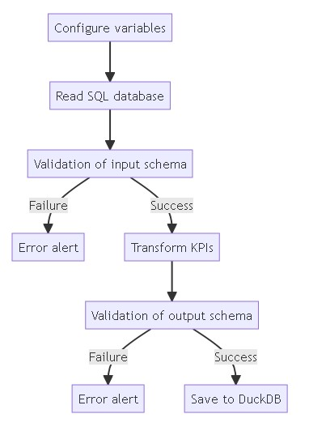

# Python ETL data quality

A project that extracts data from SQL database, validate data extracted, create transformations, validate data transformed, save to Duckdb.

## Documentation    

[](https://robinsonlovatto.github.io/python-etl-data-quality/)

**Main libs/tech:**     
    - Data validation: Pandera     
    - Documentation: Mkdocs   
    - Tests: Pytest   
    - CI/CD: Github Actions    
    - Task automation: Taskipy
    - Output database: PostgreSQL       
    - Input database: Duckdb       

### Installation

1. Clone the repository:
```bash
git clone https://github.com/robinsonlovatto/python-etl-data-quality.git
cd python-etl-data-quality
```

2. Configure the right version of Python with `pyenv`:
```bash
pyenv install 3.11.5
pyenv local 3.11.5
```

3. Configure Poetry para Python version 3.11.5 and activate the virtual environment:

```bash
poetry env use 3.11.5
poetry shell
```

4. Install the project dependencies:

```bash
poetry install
```

5. Create the PostgreSQL database (mine was created on render.com) and configure the .env file (as in .env-example).        
   Run the scripts [create table](sql/create_table_products_bronze.sql) and [insert data](sql/insert_into_products_bronze.sql) on the database.


6. Run the project:
```bash
# extract from sql db, transform, load to duckdb
poetry run python app/etl.py

# read data from duckdb and print the results
poetry run python app/read_duckdb.py
```  

7. Other commands:

```bash
# run the unit tests
poetry run task test

# run the project documentation
poetry run task doc
```
