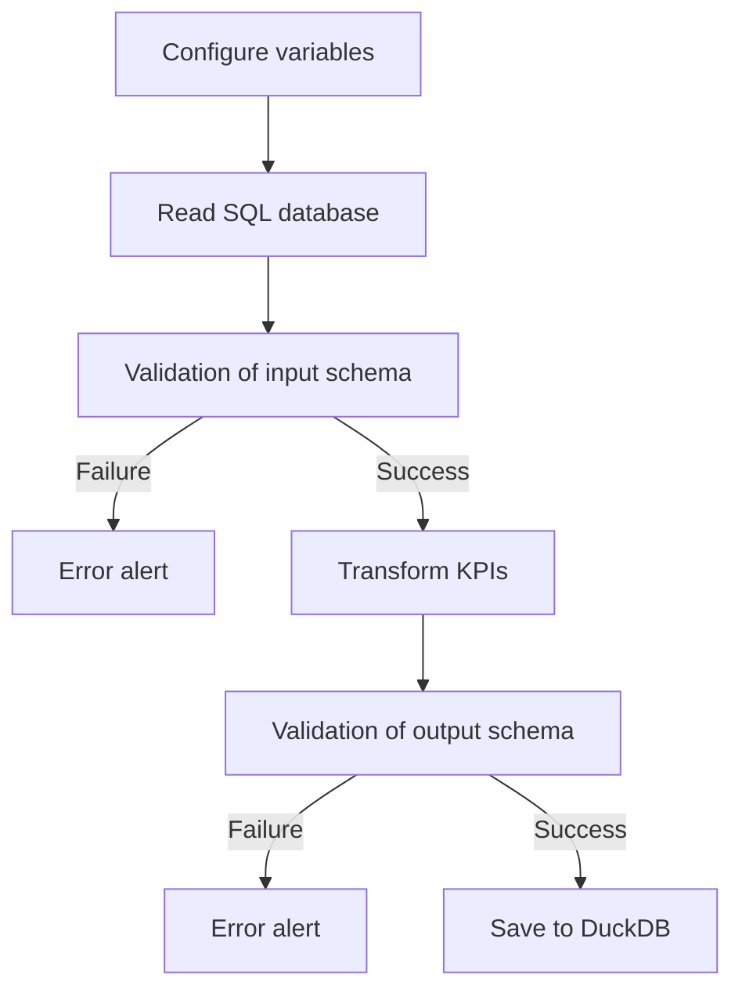

# Data quality

## Flow

```mermaid
graph TD;
    A[Configure variables] --> B[Read SQL database];
    B --> V[Validation of input schema];
    V --> |Failure| X[Error alert];
    V --> |Success| C[Transform KPIs];
    C --> Y[Validation of output schema];
    Y --> |Failure| Z[Error alert]; 
    Y --> |Success| D[Save to DuckDB]; 
```

## Data Contract

::: app.schema.ProductSchema