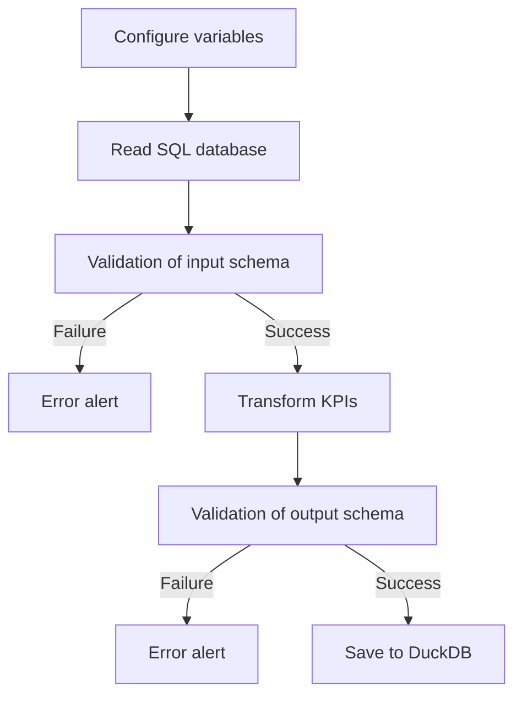

# Data quality

## Flow

## Data Contract

::: app.schema.ProductSchema

## Functions

## Configure variables

::: app.etl.load_settings

## Read from SQL database

::: app.etl.extract_from_db

## Create KPIs

::: app.etl.transform

## Save to DuckDB

::: app.etl.load_to_duckdb